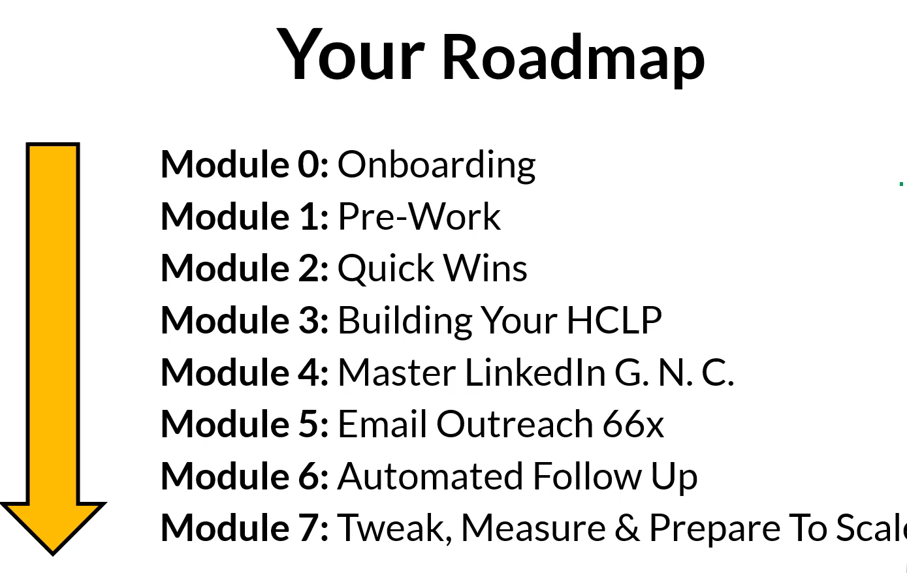

# Enquiry Generation

## Overview
I am looking to implement an automated method of lead generation and following an approach. As I learn and take steps, I will make the notes within this **md** and folder. 

Some ideas and information are already progressing, which are outlined here already:

- https://github.com/In-Data-We-Trust/Marketing-and-Branding/issues/52
- https://github.com/In-Data-We-Trust/Marketing-and-Branding/issues/53

## Useful Links

- Facebook Group Link - https://jasonsquiresonline.us5.list-manage.com/track/click?u=918d033366d214ddfca5881e9&id=876208c3c7&e=158de6b10e
- Member Login for all guidance - https://jasonsquiresonline.us5.list-manage.com/track/click?u=918d033366d214ddfca5881e9&id=88077ff74d&e=158de6b10e

## Roadmap

## Tips to Make sure this succeeds

1. Take your Time
2. A Methodical Approach
   - *Music to my ears!*
3. Imperfect Action
   -  *80/20 rule and move on*
4. Module-By-Module
5. Share Your Wins
6. Trust the Process

