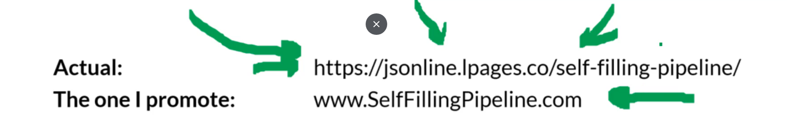
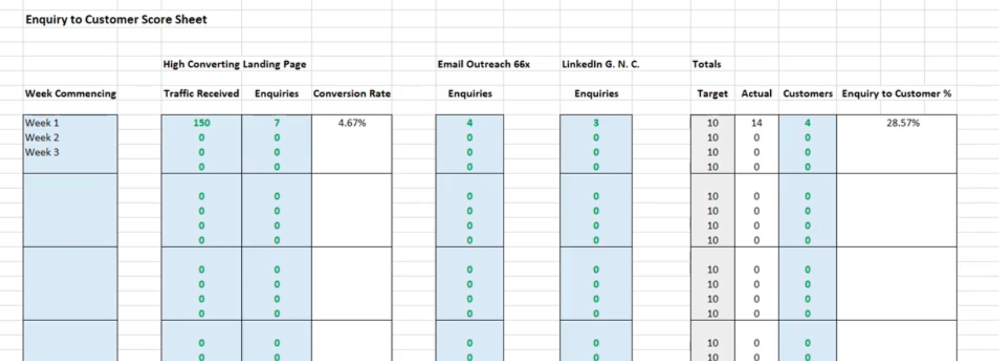
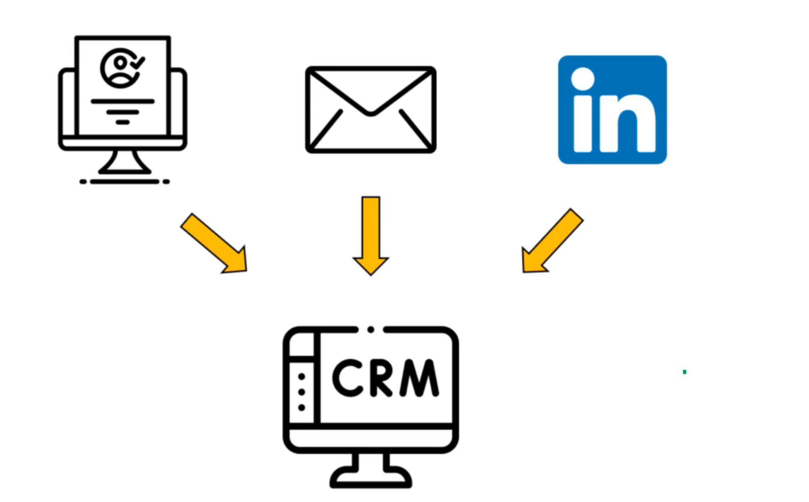
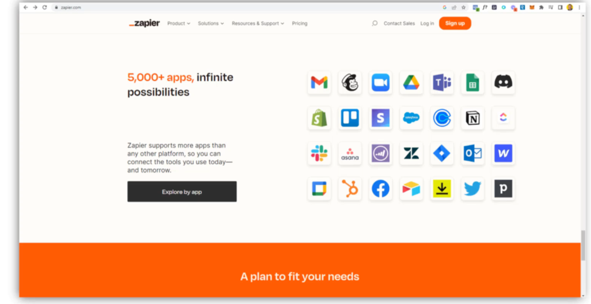
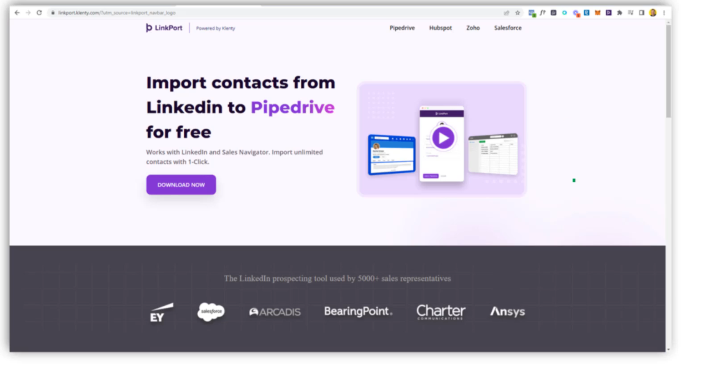
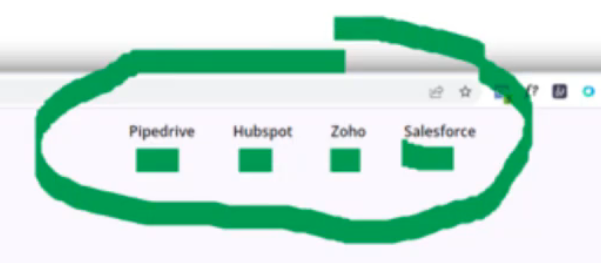
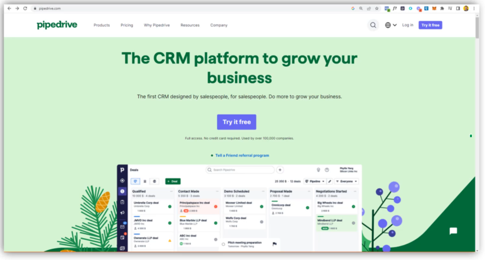
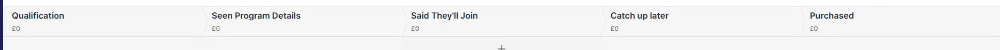

- [Module 1.1 Pre Work](#module-11-pre-work)
  - [Market](#market)
  - [Message](#message)
  - [Mechanism](#mechanism)
  - [Module 1 Plan](#module-1-plan)
- [Module 1.2 - Choosing your Target](#module-12---choosing-your-target)
  - [Task 1 - Who's your Ideal Customer?](#task-1---whos-your-ideal-customer)
- [Module 1.3 4 Stages of Awareness](#module-13-4-stages-of-awareness)
- [Module 1.4 What you're REALLY Selling](#module-14-what-youre-really-selling)
- [Module 1.5 Customer Domains](#module-15-customer-domains)
  - [What we need:](#what-we-need)
  - [Vanity Domain](#vanity-domain)
  - [Email Outreach](#email-outreach)
- [Module 1.6 Enquiry to Customer Score Sheet](#module-16-enquiry-to-customer-score-sheet)
- [Module 1.7 Integrating your CRM](#module-17-integrating-your-crm)
- [Some pre-notes whilst thinking ahead - To Archive After](#some-pre-notes-whilst-thinking-ahead---to-archive-after)
  - [Messaging](#messaging)

# Module 1.1 Pre Work

Focuses on ***Market, Message, Mechanism***

## Market

> If we are selling to everyone, we are selling to nobody

- Who we are selling too

## Message

- What are we going to say to people

## Mechanism

- How are we going to sell to people?

## Module 1 Plan
The plan laid out for Module 1 and sub-modules

# Module 1.2 - Choosing your Target

Pick one particular target, and create a campaign for them. 

For example, if you work in FS, Public Sector and Retail - the messaging that converts/attracts will be different.

## Task 1 - Who's your Ideal Customer?

The information for this has been filled out in a word document template - this can be uploaded to here once finalised. 

The module 1, problems, goals were shared with the support group. And they helped refine the messaging that can be built on, which links back to quote reference in module 1.3.

# Module 1.3 4 Stages of Awareness

Customers awareness levels to be considered, to tweak messaging and outreach

# Module 1.4 What you're REALLY Selling

Reference to consider to refine my messaging

To think of a positive and negative of hook for lenders

# Module 1.5 Customer Domains

## What we need:

1 x vanity domain for forwarding to your HCLP
1 x for your email outreach
1 x spare...for your email outreach

**Examples**

## Vanity Domain
- LendingDashboards

## Email Outreach

Don't use main email address.

Register new domain and email address for cold outreach
- PPatel-training
- PPatel-enquiries

# Module 1.6 Enquiry to Customer Score Sheet

Track your data here to refine! Preaching to the choir here....

# Module 1.7 Integrating your CRM

Can manually track enquiries in early days.........however need to know which CRM to use to integrate all for a quick mobilisation.

Visual flow of information from sources: 

Suggest tool to use is Zapier to integrate various sources into CRM

 
Use LinkPort to connect contacts from LinkedIn to Pipedrive or the other CRM tools it works with

CRM tools it works with

The one tool suggested is Pipedrive - can with a click of a button import contacts from LinkedIn!

 

Sales process used by course

I could use:

- Qualification
- Booked Call / Contacted for conversation
- Proposal Sent
- Signed off
- Catch up later
- Closed and won

# Some pre-notes whilst thinking ahead - To Archive After

## Messaging

Appealing to end clientale

Two reasons people buy:
1. Move towards goal/objective
2. Move away from Risk
   - Trusted data to be used for regulatory reporting, that is reconciled and avoid fines or mis-reporting.