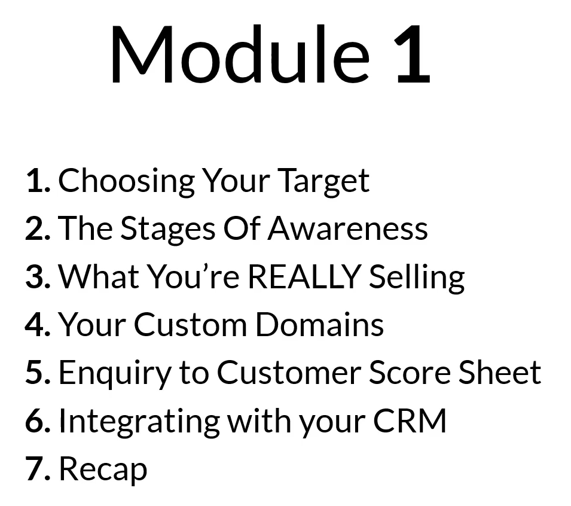
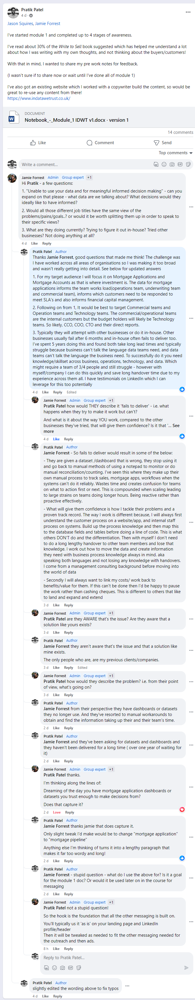
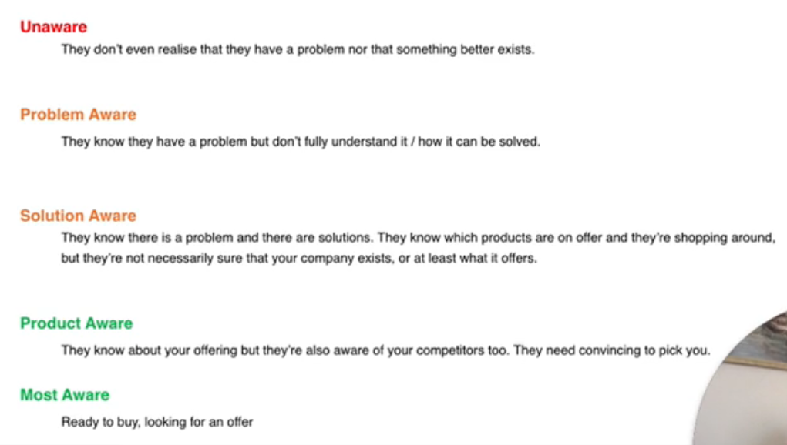
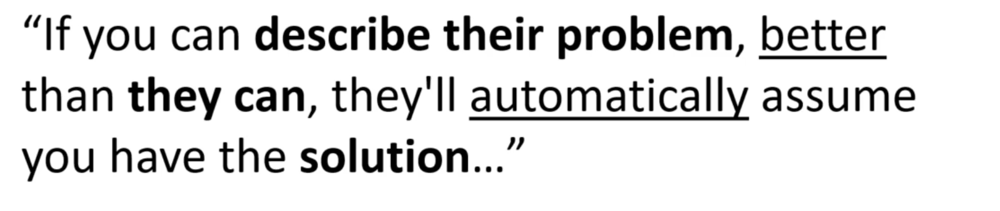

- [Pre Work](#pre-work)
  - [Market](#market)
  - [Message](#message)
  - [Mechanism](#mechanism)
  - [Module 1 Plan](#module-1-plan)
- [Module 1.1 - Choosing your Target](#module-11---choosing-your-target)
  - [Task 1 - Who's your Ideal Customer?](#task-1---whos-your-ideal-customer)
- [Module 1.2 4 Stages of Awareness](#module-12-4-stages-of-awareness)
- [Module 1.3 What you're REALLY Selling](#module-13-what-youre-really-selling)
- [Some pre-notes whilst thinking ahead - To Archive After](#some-pre-notes-whilst-thinking-ahead---to-archive-after)
  - [Messaging](#messaging)

# Pre Work

Focuses on ***Market, Message, Mechanism***

## Market

> If we are selling to everyone, we are selling to nobody

- Who we are selling too

## Message

- What are we going to say to people

## Mechanism

- How are we going to sell to people?

## Module 1 Plan
The plan laid out for Module 1 and sub-modules

# Module 1.1 - Choosing your Target

Pick one particular target, and create a campaign for them. 

For example, if you work in FS, Public Sector and Retail - the messaging that converts/attracts will be different.

## Task 1 - Who's your Ideal Customer?

The information for this has been filled out in a word document template - this can be uploaded to here once finalised. 

The module 1, problems, goals were shared with the support group. And they helped refine the messaging that can be built on, which links back to quote reference in module 1.3.

# Module 1.2 4 Stages of Awareness

Customers awareness levels to be considered, to tweak messaging and outreach

# Module 1.3 What you're REALLY Selling

Reference to consider to refine my messaging

To think of a positive and negative of hook for lenders

# Some pre-notes whilst thinking ahead - To Archive After

## Messaging

Appealing to end clientale

Two reasons people buy:
1. Move towards goal/objective
2. Move away from Risk
   - Trusted data to be used for regulatory reporting, that is reconciled and avoid fines or mis-reporting.