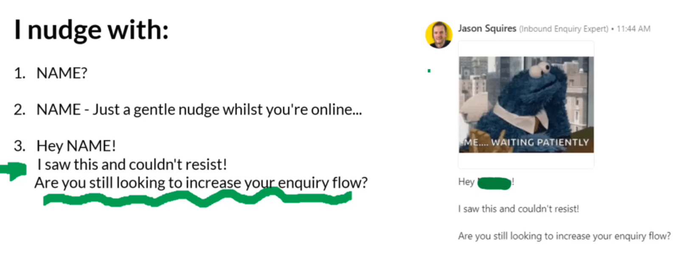

# Module 2.1 - Your Quick Wins Campaign

Will be creating a 7 day campaign

**Suggested to run a quick wins campaign every 3 months**

# Module 2.2 - 7 Day Campaign "Offer"

Tuesday 10am has best open rate for messages or emails sent

Have a Loaded Offer and as a minimum focus on **urgency and scarcity**

*Are you in the market to make your data work for you? Is it broken at the moment, Be one of the 3 clients that we are working with? We have capacity and want to help you"

Share the Loaded offer for the carrot dangle now share it on FB!

Once shared with community, the feedback received is per below. With the final Hook being 

Dreaming of the day you have lending dashboards & datasets you trust enough to make decisions from?
We're looking for 3 clients to make this happen for before [date]

# Module 2.3 - Channel 1: Previous Customers & Leads List

- Actions - To collate all leads onto a spreadsheet into a list with
  - First Name
  - Email Address

If you have under 100 emails in the list, can do manually. 

Alternatively can use mail chimp

Then to generate 3 emails from the templates.

# Module 2.4 Channel 2: LinkedIn Connections

Have 2 methods to communicate to LinkedIn Audience

1. Add a post, explaining your offer - Tuesday 10am
2. Direct Message - Relevant Connections

## Adding a Post

5x line post

To create square image, go on canva.com for 600 x 600 - use square image template

 -- Not sure I should do this currently as it might be conflicting with current project - to be considered in the future

## Direct Messaging
 
There is a LinkedIn limit of not exceeding 300 messages per day. Only send to **197 at a time for each week campaign**, and keep changing every time to 180, 198 etc. To keep it random

 
Two methods of doing this, Manually or Automated.

### 1. Manually
Suggest getting sales navigator and upgrading

To get 2 months free, if you've never had a trial with LinkedIn Premium or Sales Navigator....Sadly this won't work for me

**Message 1 - Example**

Thoughts for first liner updates:
Would having data you can use and trust, help your bank?
Would having data you can use and trust, help your manage the pipeline better at your bank?
Would having data you can use and trust, help to avoid missing deadlines? -- Not sore on this one. COME BACK TO
Would having data you can use and trust, avoid wasted time trying to find out the latest information within your bank?

**Message 2 - Follow Up**

**Message 3 - Follow Up 2**

### 2. Automation

Steps to do....

Octopus is suggested, suggested to use Monthly and Unlimited option - $40 per month. Needed as it gives access to Activity Control

To understand how to use, watch video 2.4 on the course and go to 33 minutes! - This shows the End-to-End in how to use LinkedIn search, how to use Octopus, and send messages.

### How to search for Connections on LinkedIn 

1. Use Search bar at the top
   - Use quotation marks "Head of Operations"
2. Chose location as UK
3. Use Industry to filter on
4. Can only import 1000 at a time on LinkedIn. (With sales navigater can be 2,500)
5. Then switch over to Octopus to do the messaging

### Expected response rate?

Need to track and tweak if response rate isn't as expected

# Module 2.5 - Current Customers

- Encourage buying further services
- Encourage Repeat Purchases
- Encourage referrals

# Module 2.6 - Other Channels 

In my spreadsheet where I track other leads, I can also consider business partners as leads. 

For them I can run a DIFFERENT quick wins campaign too, with tweaked messaging. For this I need to adapt the messaging slightly

# Module 2.7 - Day 1-7

Prep work is done for below:

- Looked at Channels
- Messaging is done

I will be using email channels and LinkedIn DM's channel

# Module 2.8 - Moving Leads Along

We want to be qualifying any enquiries to qualify them as a lead. So any follow up calls or meetings are a good use of time.

Qualification questions added to module_2.docx on Onedrive

## Pro Tips...

- When using DM's, been available to respond. We should receive responses within 1 hour!
- When sending emails, send 2 Q's at a time. No more than 2 emails to qualify

For tracking people that need responses, mark messages as unread as a to-do list. Same as my emails at work!

Use Text Blaze (free chrome plugin) to simplify the process of responding to lots of people.
*Only needed once volume increases*
https://blaze.today/

## Avoid Ghosting

You can nudge 3 times, and then leave them

- Nudge 1 - wait 1-2 hours
- Nudge 2 - wait one more day
- Nudge 3 - wait one more day

Other ways of Nudging:

CRM reminder - add all leads to CRM to track - suggested is pipedrive

# Module 2.8 - Recap

## What Next?

Plan the next one and think when is best to do it!